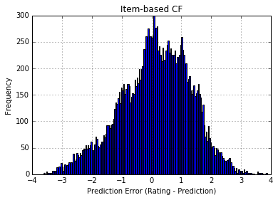
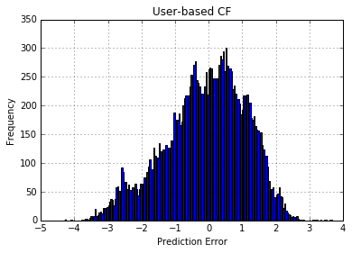

## Dataset: MovieLens 100k
我選擇的是最小的資料規模，因為換到大一點的資料，我的記憶體就沒辦法load了。
選擇這麼小的data，結果movie和user的個數是差不多的。

不知道是不是因為這個原因，兩個演算法的效能在這裡比較不出什麼。

# Measurement
|               | $\|err\| <0.5$ | Converge | MAE      |   |
|---------------|----------------|----------|----------|---|
| Item-Based CF | 0.3121         | 0.9981   | 0.125065 |   |
| User-Based CF | 0.3176         | 0.9981   | 0.125065 |   |

